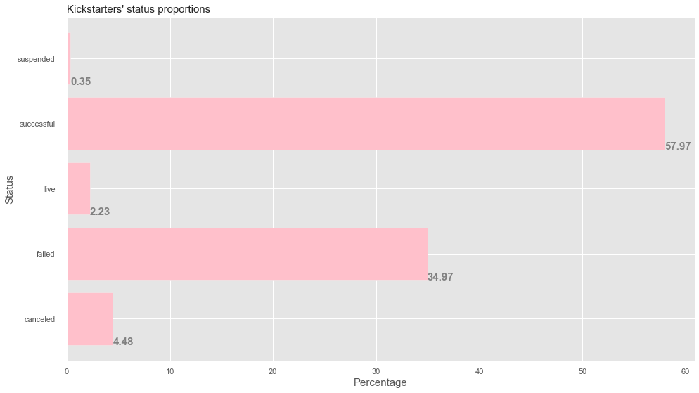
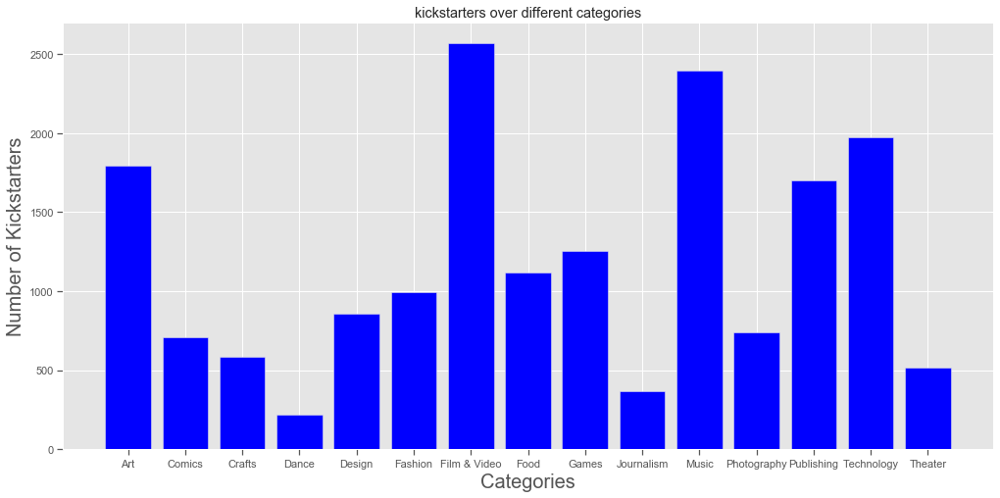
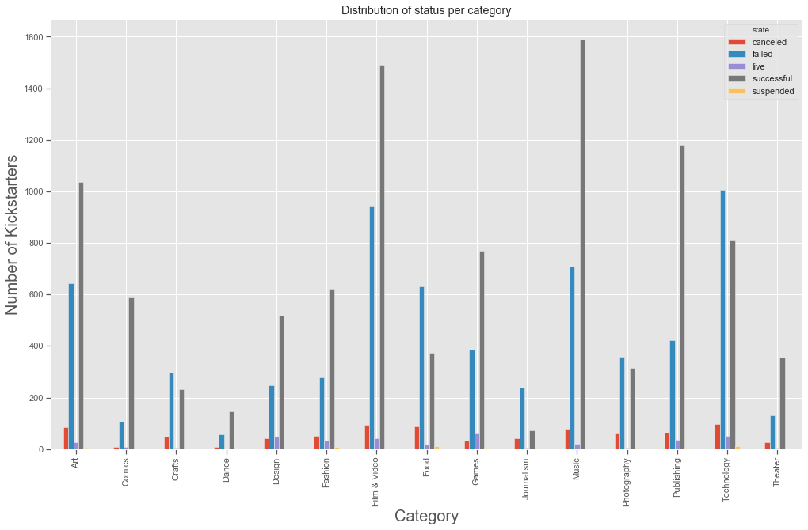
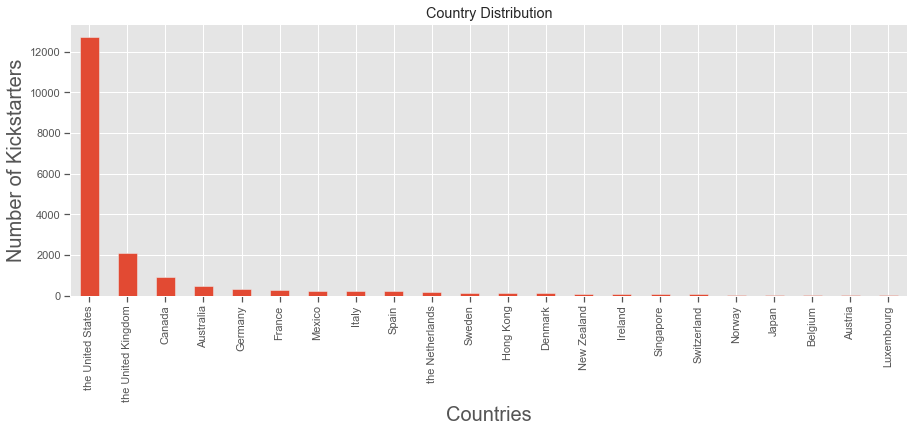
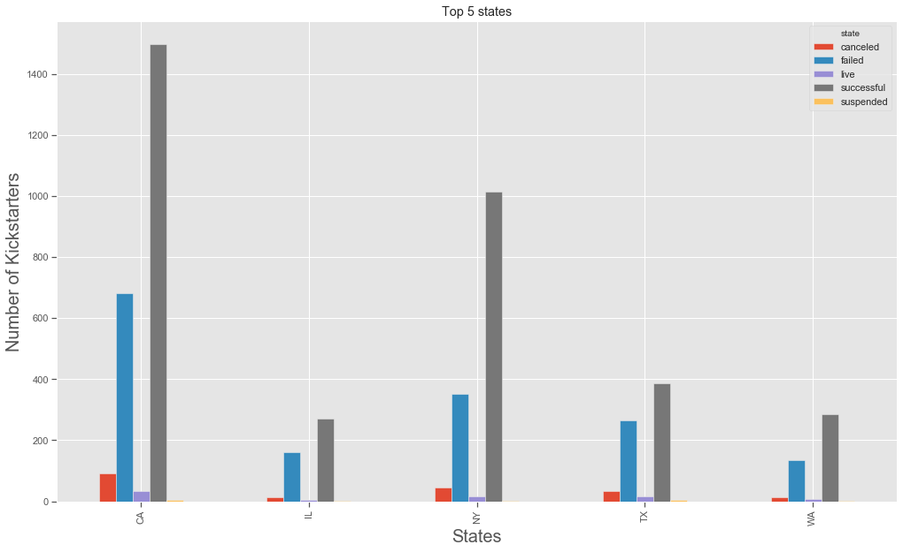

# Kickstarter EDA and Hypothesis Testing

I explored kickstarter datasets. My goal was to examine the data and report key findings.

# Data Analysis

* Dataset had 33 indicators tracking category, location, backers count, goal etc for 18000 kickstarters.
* Data had json objects in a couple of columns. Which were parsed to obtain relevenat key value pairs. Unix timestamp columns were converted to datetime columns for statistical analysis.
* Dataset has "Nan" which were strategically handled to only include columns/attributes which had valid data in them.
* Dataset is a mix of numerical, datetime, string and categorical columns.

# Features Analysed

* Number of kickstarters with in type of status i.e successful, failed, live, camceled or suspended.
* Most popular category amongst kickstarters.
* Most successful category amongst kickstarters.
* Differences between successful and failed kickstarted in average days between creation-to-launch and launch-to-deadline.
* Country, states with maximum number of kickstarters.
* Analysed differences in success probabilities of kickstarters between states using frequentist and Bayesian approach.
* Robustness of tests was checked through power analysis.

## Number of kickstarters according to different status

**Observation**: Dataset has close to 58% successful kickstarters, 35% failed kickstarters.

## Most popular categories

**Observation**: Film & Video, Music and Technology is amongst top three categories.

## Top successful and unsuccessful categories.

**Observation**: Music has maximum number of successful kickstarters, 1589 and Technology is the only category which has more failed kickstarters than successful ones.

## Number of kickstarters per country

**Observation**: The United states has maximum number of kickstarters, ~13000 followed by The United Kingdom with ~2000 kickstarters.

## States within United States with maximum number of kickstarters

**Observation**: CA has most nmu,ber of successful kickstartes, ~1450 followed by NY with ~1000 successful kickstarters but in terms of percentage NY is ahead of CA.

## Top successful categories in each state
**Observation**: A Music kickstarter is 78% likely to succeed NY whereas it is 63% likely to succeed in TX.

## Average run time for a successful kickstarter for every category.
**Observation**: A games category kickstarter is likely to succeed in ~25 days in TX and a Technology category kickstarter in CA is likely to succeed in ~36 days.

## Average number of backers
**Observation**: An art kickstarter in CA need ~90 backers to succeed whereas a gaming kickstarter in CA needs ~ 2200 backers to succeed.

## Average number of days between creation and launch & launch and deadline.
**Observation**: A food kickstarter in IL is likely to succeed if it has ~16 days between its creation date and launch date & ~33 days before its deadline.

## A/B Testing and Power Analysis
Samples between NY and CA were analysed to examine if a publishing kickstarter has better chance to succeed in NY than in CA.

Both frequentist hypothesis testing and Bayesian A/B testing confirmed NY being better than CA for publishing category.
